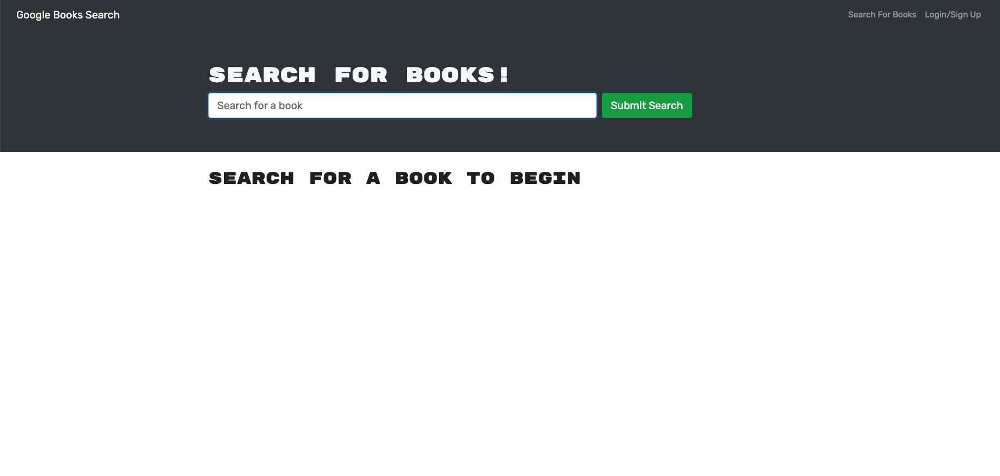
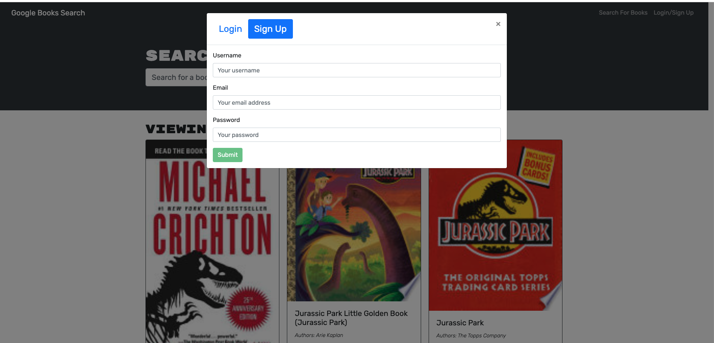
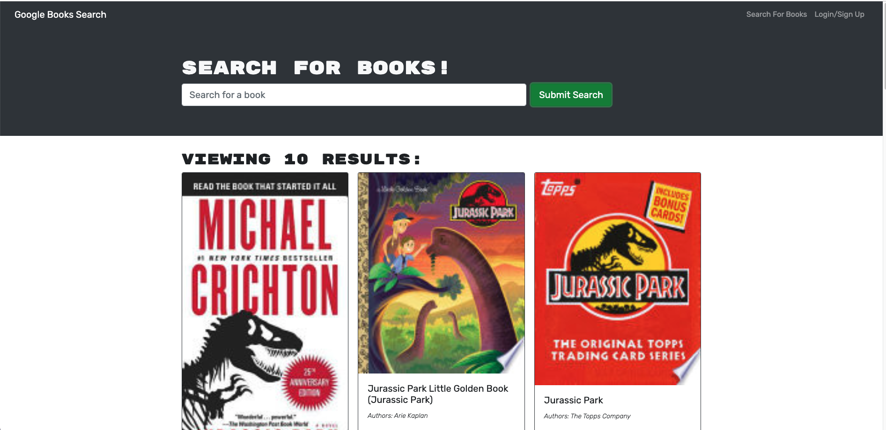

# Book Search Engine

 MERN project

## Description

In this project I took a Google Books API search engine that was initially built with RESTful API and refactored into a GraphQL API using the Apollo Server.  This was built using the MERN stack.  React as the front end, MongoDB as the database, and Node.js/Express.js.

Users of this app can sign up, login, and search for books.  Find a book that you like you can save it to your account.  Tired of that book?  Then remove it from your account with ease.

## Table of Contents

[User Story](#user-story) 
[Project Criteria](#project-criteria) 
[Installation](#installation) 
[Preview](#preview) 
[Questions](#questions)

## User Story

AS AN avid reader 
I WANT to search for new books to read 
SO THAT I can keep a list of books to purchase

## Project Criteria

GIVEN a book search engine 
WHEN I load the search engine 
THEN I am presented with a menu with the options Search for Books and Login/Signup and an input field to search for books and a submit button 
WHEN I click on the Search for Books menu option 
THEN I am presented with an input field to search for books and a submit button 
WHEN I am not logged in and enter a search term in the input field and click the submit button 
THEN I am presented with several search results, each featuring a book’s title, author, description, image, and a link to that book on the Google Books site 
WHEN I click on the Login/Signup menu option 
THEN a modal appears on the screen with a toggle between the option to log in or sign up 
WHEN the toggle is set to Signup 
THEN I am presented with three inputs for a username, an email address, and a password, and a signup button 
WHEN the toggle is set to Login 
THEN I am presented with two inputs for an email address and a password and login button 
WHEN I enter a valid email address and create a password and click on the signup button 
THEN my user account is created and I am logged in to the site 
WHEN I enter my account’s email address and password and click on the login button 
THEN I the modal closes and I am logged in to the site 
WHEN I am logged in to the site 
THEN the menu options change to Search for Books, an option to see my saved books, and Logout 
WHEN I am logged in and enter a search term in the input field and click the submit button 
THEN I am presented with several search results, each featuring a book’s title, author, description, image, and a link to that book on the Google Books site and a button to save a book to my account 
WHEN I click on the Save button on a book 
THEN that book’s information is saved to my account 
WHEN I click on the option to see my saved books 
THEN I am presented with all of the books I have saved to my account, each featuring the book’s title, author, description, image, and a link to that book on the Google Books site and a button to remove a book from my account 
WHEN I click on the Remove button on a book 
THEN that book is deleted from my saved books list 
WHEN I click on the Logout button 
THEN I am logged out of the site and presented with a menu with the options Search for Books and Login/Signup and an input field to search for books and a submit button

## Installation

To install this project please clone the repository 
After cloning, in your terminal run `npm i` to install packages

## Preview

Deployed with [Heroku](https://rocky-sea-41722.herokuapp.com/)

When you open the app this is the page you first see.

You can click on the Login/Sign Up form to login.

Viewing search results for book title.
## Questions

If you have questions regarding this project or others you can reach me by: 
Email: kate.epatch@gmail.com 
Github: [katepatch](https://github.com/katepatch)
